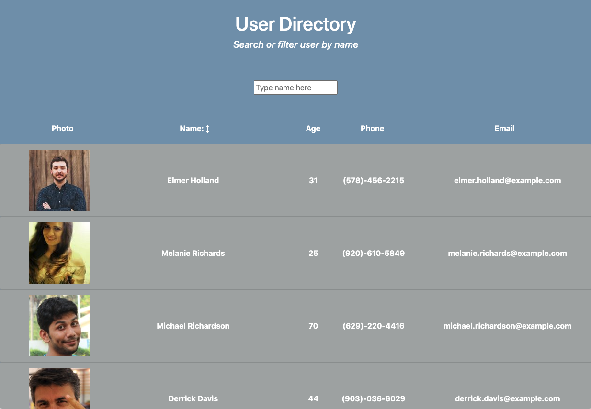

# Project Name 
<!--  -->
  User Directory

  ## Overview 
  A React app directory where users/employees can be viewed by a filter of first or last name.

  ## Table of Contents:
  - [Links to Deployed app](#Links (*deployed app and repo*))
  - [Screenshots and Vids](#Screenshots_and_Vids)
  - [Motivation](#Motivation)
  - [Installation](#Installation)
  - [How to use](#How_to_use)
  - [Benefit](#Benefit)
  - [License](#License)
  - [Tests](#Tests)
  - [Contribute](#Contribute)

 ## Links (*deployed app and repo*)
  - [GitHub Pages](https://jmeggles.github.io/19_User_Directory/)
  - [GitHub Repo](https://github.com/jmeggles/19_User_Directory)

 ## Screenshots_and_Vids 
  - 
  -   
  - 
  -   
  - 
  
  ## Motivation
  Why was this project started.

  ## Installation
  No installation needed.  Click *[here](https://jmeggles.github.io/19_User_Directory/)* to use the deployed app.

  ## How_to_use
  Once the React application is opened, sort users by first or last name to view that person's information. *(Disclaimer: This uses a random generator with fake names, numbers, and other information as templates to show app functionality.)*  

  ## Benefit
  An employee or manager would benefit greatly from being able to view non-sensitive data about other employees sorted/filtered by selected column such as first and last names.

  ## Credits
  John Dinsmore, Jorge Alvarez, & Ben Benson with *WebDev Tutoring*

  ## Tests

 
  ## License 
  [MIT License](https://opensource.org/licenses/MIT)
  
  Copyright © 2020 Jody Eggleston 

  ## Contribute
  For comments and/or questions, contact Jody Eggleston via 
  